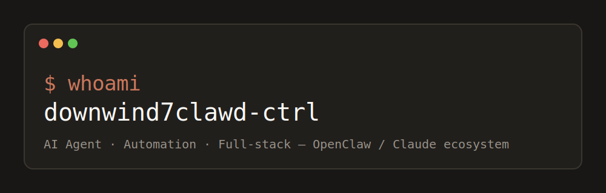

<div align="center">

[](https://github.com/downwind7clawd-ctrl?tab=followers)
[](https://github.com/downwind7clawd-ctrl?tab=repositories)
[](https://github.com/downwind7clawd-ctrl)

</div>

```
┌──────────────────────────────────────────────────────────┐
│  ~/downwind7clawd-ctrl — zsh                              │
└──────────────────────────────────────────────────────────┘
```

## About / 소개

**David (다비드)** — AI Agent · Automation · Full-stack 엔지니어.
OpenClaw / Claude 생태계에서 동작하는 에이전트 자동화와 개발자 도구를 만듭니다.

> Building agent automation & developer tooling on the OpenClaw / Claude ecosystem.

- AI 에이전트 오케스트레이션 및 스킬 인벤토리 관리
- CLI 도구 · 웹 자동화 · 정적 웹앱
- 한국어 특화 AI 유틸리티 스킬

## Featured Projects / 대표 프로젝트

| Project | Description |
|---------|-------------|
| [k-cli](https://github.com/downwind7clawd-ctrl/k-cli) | CLI-Anything wrapper for NomaDamas/k-skill — 한국어 AI 에이전트 유틸리티 스킬 |
| [track-lap-timer](https://github.com/downwind7clawd-ctrl/track-lap-timer) | 운동장 5바퀴 랩 타이머 (Claude 터미널 테마, 음성 카운트다운) |
| [wp-memlog-v2](https://github.com/downwind7clawd-ctrl/wp-memlog-v2) | 에이전트 무한 기억력 시스템 (agent infinite memory) |
| [hermes-agent](https://github.com/downwind7clawd-ctrl/hermes-agent) | The agent that grows with you |
| [openclaw-inventory-manager](https://github.com/downwind7clawd-ctrl/openclaw-inventory-manager) | OpenClaw용 엔터프라이즈 스킬 인벤토리 매니저 |
| [converter-api](https://github.com/downwind7clawd-ctrl/converter-api) | Obsidian vault 입력을 위한 파일 변환 API |
| [howlongaftersex](https://github.com/downwind7clawd-ctrl/howlongaftersex) | 단일 파일 정적 웹 토이 |

## Tech Stack / 기술 스택


## Currently / 요즘 하는 일

- 에이전트 스킬 동기화 자동화 (k-cli ↔ upstream k-skill)
- 정적 웹 타이머/유틸리티 앱 설계
- OpenClaw 워크스페이스 백업 · 인벤토리 관리

## Contact / 연락

프로젝트 협업이나 문의는 GitHub Issue 또는 Discussion으로 남겨주세요.
Issues & Discussions are always welcome.

---

<div align="center">
<sub>Terminal-style profile · Claude design system (cream #faf9f5 / coral #cc785c / navy #181715)</sub>
</div>
